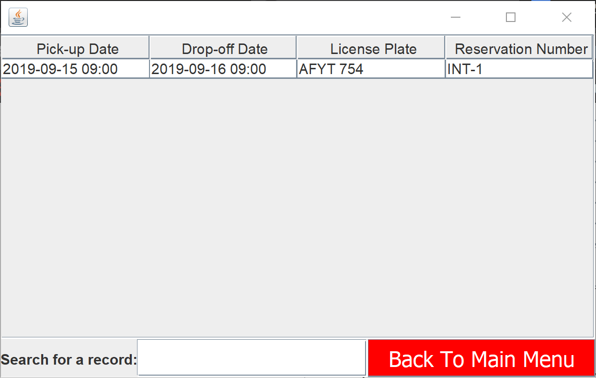

# SupremeCarRentals 
  

Note: Progject is still under development as database management is being from Excel to SQLite

SupremeCarRentals is a Java Program that can be used by a car rental company to create rental reservations, store customer information, and create a PDF invoice for reservations which can be printed.

# Usage

## Login Menu

- To login into the application use the following credentials: Username = "Admin" and Password = "password123"

## Renting a Car

- In the main menu choose "Rent Car" option which will take you to this screen: 

- Toronto Supreme Car Rentals is only open from 9:00 AM to 9:00 PM so those are the only available times 
- All reservations must be made a day in advance and it must be at least one day long in duration

- After valid reservation details are provided you will be taken to this screen:

- The JComboBox only allows the users to select cars that are available based on their chosen dates for their chosen vehicle type, in this case it is Economy.

- After a valid car is choosen you will asked to enter the customer's information: 

- The above is an example of valid customer information
- The first and last names can contain lower and uppercase letters, periods, commas, apostrophes, and dashes
- The accepted credit cards are Visa and Mastercard and must fit those standards
- The insurance number should only be provided if the customer wants to use their own insurance and must contain 5 uppercase letters followed by two numbers
- The driver license number follows the Ontario driver license format which is LNNNN-NNNNN-NNNNN where L is a capital letter and N is a number

## Viewing Database Tables

- To view tables choose "View" in the main menu and choose any of the 3 available tables ("Car", "Reservation", "Customer")
- You can also narrow down the table data by specifying any key word
- You can also change the column orders by clicking and dragging the columns
- You can also sort each column by click on the top of each column

### Car Table

### Reservation Table

### Customer Table

# Pricing

- Pricing is calculated on a variety of factors which include the car type, rental duration, insurance coverage, and car's fuel level when returned

## Car Type

| Car Type          | Price Per Day |
| ----------------- | ------------- |
| Economy           | $23.94        |
| Compact           | $29.50        |
| Intermediate      | $34.50        |
| Standard Size     | $39.50        |
| Full Size         | $45.00        |
| Mini Van/7 Seater | $75.99        |
| Premium           | $85.50        |
| Luxury            | $95.50        |
| Supreme           | $100.45       |
| Intermediate SUV  | $60.45        |
| Standard SUV      | $65.45        |
| Large SUV         | $75.45        |
